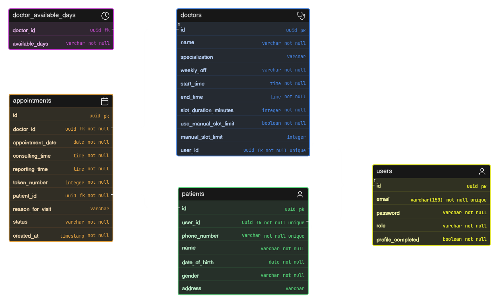

# Doctor Appointment Booking System

A Spring Boot backend application for managing doctor appointment booking with authentication, doctor availability, slot management, and appointment scheduling.

The system allows users to register and log in using JWT-based authentication. Users can create profiles based on their role as either a doctor or patient. Doctors can configure their availability, working days, consultation time, slot duration, and manual slot limits. Patients can view available doctors, check available appointment slots, and book appointments based on doctor availability.

The appointment booking system dynamically generates time slots from the doctor’s schedule and checks already booked appointments to show only available slots. If a selected slot is already booked or invalid, the system prevents duplicate booking and returns an appropriate error response.

## Key Features

- JWT-based user authentication
- Role-based profile setup for doctors and patients
- Doctor profile management
- Patient profile management
- Doctor listing for appointment selection
- Doctor availability configuration
- Dynamic appointment slot generation
- Check available slots by doctor and date
- Book appointments with selected doctor and time slot
- Token number generation for appointments
- Appointment status tracking
- H2 database for development
- PostgreSQL support planned for production

## Tech Stack

- Java 17
- Spring Boot 3.x
- Spring Security
- JWT
- Spring Data JPA
- Hibernate
- H2 Database (development)
- PostgreSQL
- Maven

## Database Design

The ER diagram represents the core database structure of the Doctor Appointment Booking System.

The system has five main tables: `users`, `doctors`, `patients`, `appointments`, and `doctor_available_days`.

- The `users` table stores authentication-related information such as email, password, role, and profile completion status.
- The `doctors` table stores doctor profile details and is linked with the `users` table using `user_id`.
- The `patients` table stores patient profile details and is also linked with the `users` table using `user_id`.
- The `doctor_available_days` table stores the working days of each doctor.
- The `appointments` table stores appointment booking details, including doctor, patient, appointment date, consulting time, reporting time, token number, status, and reason for visit.

**Relationships:**
- One user can have one doctor profile or one patient profile.
- One doctor can have multiple available days.
- One doctor can have many appointments.
- One patient can have many appointments.
